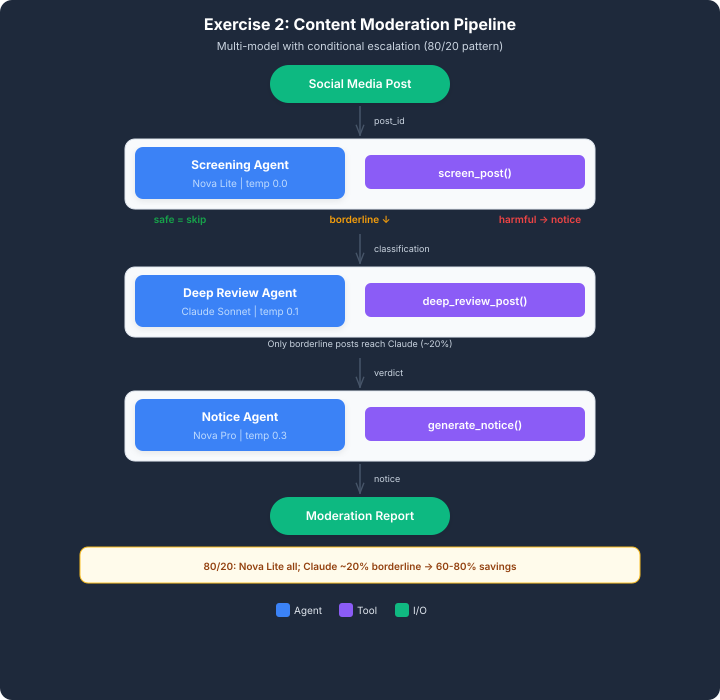

# aws-content-moderation-pipeline
A tiered, multi-model content moderation pipeline built with Amazon Bedrock, Strands Agents, Nova Lite, Claude Sonnet, and Nova Pro.

# Tiered Multi-Model Content Moderation Pipeline

### A Cost-Aware Multi-Agent AI System Built with Amazon Bedrock and Python

## Project Overview

This project demonstrates the implementation of a tiered, multi-model content moderation pipeline for a growing social media platform.

The system uses three specialized AI agents to screen incoming posts, perform contextual reviews of ambiguous content, and generate user-facing moderation notices.

Rather than processing every post through a computationally intensive AI model, the pipeline uses conditional routing to reserve advanced review for posts that require additional analysis.

The application was developed as part of the Udacity AWS Future Agentic AI Engineer Nanodegree.

## Business Problem

A growing social media platform needs to moderate an increasing volume of user-generated content while maintaining reasonable processing latency and managing AI inference costs.

Using an advanced AI model to review every incoming post can introduce unnecessary processing overhead.

The platform requires a moderation system that can:

* Quickly identify clearly safe and harmful content.
* Escalate ambiguous posts for contextual review.
* Generate appropriate user-facing notices for harmful content.
* Avoid unnecessary advanced-model invocations.
* Measure processing latency across different moderation paths.

## Solution Architecture

The solution implements a three-stage, multi-agent moderation pipeline using Amazon Bedrock.



### Agent 1: Screening Agent

**Model:** Amazon Nova Lite

**Temperature:** 0.0

**Tool:** `screen_post()`

The screening agent processes every incoming post.

It invokes a keyword-based screening tool that returns one of three classifications: SAFE, HARMFUL, or BORDERLINE, together with a confidence score.

Safe posts are fast-tracked, harmful posts trigger notice generation, and borderline posts are escalated for further review.

### Agent 2: Deep Review Agent

**Model:** Anthropic Claude Sonnet 4.5

**Temperature:** 0.1

**Tool:** `deep_review_post()`

The deep review agent processes only posts classified as BORDERLINE.

It invokes the provided review tool to retrieve a final SAFE or HARMFUL verdict with a brief explanation.

The exercise demonstrates how contextual distinctions, including figurative language, strong criticism, and potentially harmful health claims, can be incorporated into moderation decisions.

The starter application uses predefined review verdicts for the sample posts rather than independently generating every moderation decision.

### Agent 3: Notice Agent

**Model:** Amazon Nova Pro

**Temperature:** 0.3

**Tool:** `generate_notice()`

The notice agent is invoked only when a post receives a final HARMFUL verdict.

It calls the notice-generation tool to retrieve the moderation action and predefined notice template, then produces a user-facing message explaining the moderation decision.

In the supplied application, notices are generated and displayed in the terminal. No external email or messaging service is configured.

## Technology Stack

| Technology         | Purpose                                                   |
| ------------------ | --------------------------------------------------------- |
| Python             | Application development and conditional routing           |
| Amazon Bedrock     | Access to foundation models                               |
| Amazon Nova Lite   | Initial content screening                                 |
| Claude Sonnet 4.5  | Deep review of borderline posts                           |
| Amazon Nova Pro    | Moderation notice generation                              |
| Strands Agents SDK | Agent creation, tool integration, and model orchestration |
| Boto3              | AWS SDK dependency                                        |
| python-dotenv      | Environment configuration                                 |

## Project Structure

```text
content-moderation-pipeline/
├── content_moderation.py
├── README.md
├── architecture.svg
├── requirements.txt
├── .env.example
├── .gitignore
└── screenshots/
```

## Implementation

The implementation consists of three agent-building functions:

`build_screening_agent()`

Configures Amazon Nova Lite with a deterministic temperature setting, a screening system prompt, and the `screen_post` tool.

`build_review_agent()`

Configures Claude Sonnet 4.5 with a low temperature setting, a contextual review system prompt, and the `deep_review_post` tool.

`build_notice_agent()`

Configures Amazon Nova Pro with a slightly higher temperature setting, a user communication system prompt, and the `generate_notice` tool.

The main function executes the moderation pipeline using conditional routing based on the screening classification and final review verdict.

## How to Run the Project

### 1. Clone the repository

```bash
git clone https://github.com/YOUR_USERNAME/YOUR_REPOSITORY.git
cd YOUR_REPOSITORY
```

Replace the placeholders with the actual GitHub repository details.

### 2. Install dependencies

Use Python 3.11 or later.

```bash
python -m pip install -r requirements.txt
```

### 3. Configure your environment

```bash
cp .env.example .env
```

Configure the AWS region and Bedrock model identifiers in `.env`.

Ensure that valid AWS credentials are available to boto3 through your AWS configuration or environment variables.

The AWS identity must have the necessary permissions to invoke the selected Amazon Bedrock models.

Never commit AWS credentials or your `.env` file to a public repository.

### 4. Run the application

```bash
python content_moderation.py
```

The application processes nine sample social media posts and displays the moderation results and latency comparison.

## Testing and Validation

The completed application successfully processed all nine sample posts.

| Post ID  | Initial Screening | Final Verdict |
| -------- | ----------------- | ------------- |
| POST-001 | SAFE              | SAFE          |
| POST-002 | SAFE              | SAFE          |
| POST-003 | SAFE              | SAFE          |
| POST-004 | HARMFUL           | HARMFUL       |
| POST-005 | HARMFUL           | HARMFUL       |
| POST-006 | HARMFUL           | HARMFUL       |
| POST-007 | BORDERLINE        | SAFE          |
| POST-008 | BORDERLINE        | HARMFUL       |
| POST-009 | BORDERLINE        | SAFE          |

**Final moderation results:**

* Total posts processed: 9
* Safe posts: 5
* Harmful posts: 4
* Posts escalated for deep review: 3
* Moderation notices generated: 4

All nine posts followed their expected moderation paths during the successful execution.

## Latency Comparison

The application measures the execution time of each moderation stage and reports the processing latency for different routing paths.

The successful exercise run produced the following results:

| Metric                        | Observed Result |
| ----------------------------- | --------------- |
| Average fast-track latency    | 1.3 seconds     |
| Average full-pipeline latency | 5.9 seconds     |
| Reported fast-track speedup   | 4.7×            |

The results demonstrate that safe posts can be processed without invoking the advanced review model.

These figures represent the observed performance of this exercise run and are not guaranteed production benchmarks.

## Engineering Lessons

This project demonstrates several concepts relevant to the development of multi-agent AI systems.

**Model specialization:** Different foundation models can be assigned distinct responsibilities within the same application.

**Conditional routing:** The moderation pipeline invokes additional agents only when the preceding moderation stage requires them.

**Tool integration:** Strands Agents provides a mechanism for connecting foundation models to Python functions that perform application-specific tasks.

**Deterministic processing:** Low-temperature model configurations and predefined moderation tools support consistent results for the supplied test cases.

**Performance measurement:** Per-stage latency reporting provides visibility into the processing overhead associated with each moderation path.

## Limitations and Future Improvements

This project is an educational prototype rather than a production-ready moderation service.

The screening tool relies on predefined keywords and confidence scores, while the deep review tool uses predetermined verdicts for the provided sample posts.

Future improvements could include evaluating a larger and more diverse dataset, introducing calibrated confidence thresholds, adding human review for uncertain decisions, implementing persistent moderation records, and measuring actual inference costs.

## Project Evidence

Implementation screenshots and terminal execution results are available in the `screenshots/` directory.

They document the agent configurations, conditional routing, moderation results, and latency comparison.

## Author

**Ayomikun Adaramola**

Senior Data Engineer | AI & Cloud Engineering

Developed as part of the Udacity AWS Future Agentic AI Engineer Nanodegree.
